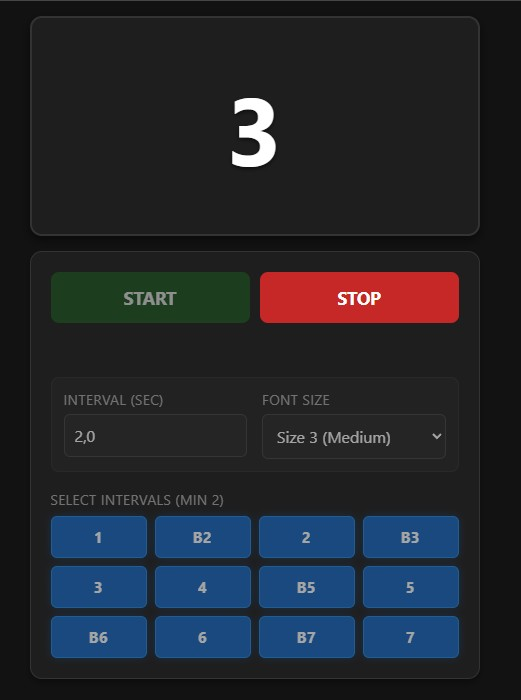

# Interval Trainer

A lightweight, mobile-friendly web application designed to help musicians practice interval recognition and visualization. The app displays musical intervals in a randomized, looped sequence, making it an ideal tool for fretboard training, mental visualization, or ear training drills.

---

## Key Features

* **Custom Interval Selection:** Choose exactly which intervals you want to practice (from `1` up to `7`, including accidentals like `b3`, `b5`, `b7`, etc.).

* **Smart Distribution Loop:** Uses a shuffling algorithm that guarantees you will be tested on **every single selected interval exactly once** per cycle before a new randomized cycle begins. This ensures balanced practice.

* **Smart Transitions:** Built-in safeguards prevent the exact same interval from appearing twice in a row during cycle transitions.

* **Configurable Speed:** Adjust the display timer from ultra-fast (**0.1 seconds**) up to relaxed (**10 seconds**).

* **Responsive, Dark UI:** Designed with a clean, dark-themed vertical layout optimized for both mobile phones on a music stand and desktop screens.

* **Adjustable Font Sizes:** Choose between 5 different font sizes to fit your screen and viewing distance perfectly.

---

## How to Use

1. **Launch the App:** Open the web application directly in your browser using the provided link.

2. **Configure Settings:**

&#x20;  * Select at least 2 intervals using the toggle buttons.

&#x20;  * Enter your preferred display time per interval (in seconds).

&#x20;  * Select a comfortable font size.

3. **Start Training:** Click **START** to begin the automated training loop. Click **STOP** at any time to pause the loop and reset the screen.

---

## Technical Specifications

* Built entirely as a standalone web app (`index.html`) using HTML5, CSS3, and Vanilla JavaScript.

* Zero external dependencies or frameworks—runs completely client-side in any modern web browser.

* Utilizes the **Fisher-Yates Shuffle algorithm** to ensure completely unbiased and uniform random distribution across practice cycles.

